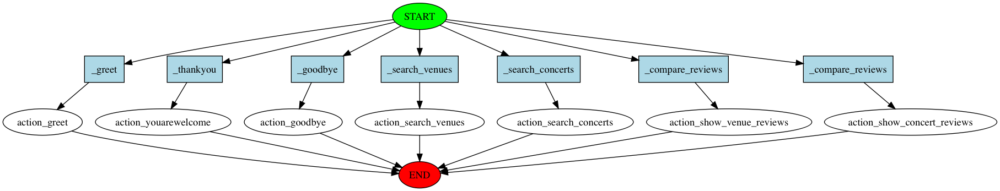

:desc: Tips for Debugging a Rasa bot

.. _debugging:

Debugging
=========

.. note:: 

   Wherever you are talking to the bot (command line, slack, facebook, etc), you can
   clear the tracker and start a new conversation by sending the message ``/restart``.

To debug your bot, run it on the command line with the ``--debug`` flag. 

For example:

.. code-block:: bash

  python -m rasa_core.run -d models/dialogue -u models/nlu/current --debug

This will print lots of information to help you understand what's going on.
For example:

.. code-block:: bash
   :linenos:

    Bot loaded. Type a message and press enter: 
    /greet
    rasa_core.tracker_store - Creating a new tracker for id 'default'.
    rasa_core.processor - Received user message '/greet' with intent '{'confidence': 1.0, 'name': 'greet'}' and entities '[]'
    rasa_core.processor - Logged UserUtterance - tracker now has 2 events
    rasa_core.processor - Current slot values: 

    rasa_core.policies.memoization - Current tracker state [None, {}, {'prev_action_listen': 1.0, 'intent_greet': 1.0}]
    rasa_core.policies.memoization - There is a memorised next action '2'
    rasa_core.policies.ensemble - Predicted next action using policy_0_MemoizationPolicy
    rasa_core.policies.ensemble - Predicted next action 'utter_greet' with prob 1.00.
    Hey! How are you?

Line number ``4`` tells us the result of NLU parsing the message 'hello'.
If NLU makes a mistake, your Core model won't know how to behave. A common
source of errors is that your NLU model didn't accurately pick the intent,
or made a mistake when extracting entities. If this is the case, you probably
want to go and improve your NLU model.

If any slots are set, those will show up in line ``6``.
and in lines ``9-11`` we can see which policy was used to predict the next action.
If this exact story was already in the training data and the :class:`MemoizationPolicy`
is part of the ensemble, this will be used to predict the next action with probability 1.

If all the slot and NLU information is correct but the wrong action is still predicted,
you should check which policy was used to make the prediction. 
If the prediction came from the :class:`MemoizationPolicy`, then there is an error in
your stories. If a probabilistic policy like the :class:`KerasPolicy` was used,
then your model just made a prediction that wasn't right. In that case 
it is a good idea to run the bot with interactive learning switched on so you can
create the relevant stories to add to your training data.

.. _story-visualization:

Visualizing your Stories
------------------------

Sometimes it is helpful to get an overview of the conversational paths that
are described within a story file. To make debugging easier and to ease
discussions about bot flows, you can visualize the content of a story file.

.. note::
   For this to
   work, you need to **install graphviz**. These are the instructions to do that
   on OSX, for other systems the instructions might be slightly different:

   .. code-block:: bash

      brew install graphviz
      pip install pygraphviz --install-option="--include-path=/usr/include/graphviz" \
        --install-option="--library-path=/usr/lib/graphviz/"

As soon as this is installed you can visualize stories with this command:

..  code-block:: bash

   cd examples/concertbot/
   python -m rasa_core.visualize -d concert_domain.yml -s data/stories.md -o graph.png

This will run through the stories of the ``concertbot`` example in
``data/stories.md`` and create a graph stored in the
output image ``graph.png``.

We can also run the visualisation directly from code. For this example, we can
create a ``visualize.py`` in ``examples/concertbot`` with the following code:

.. literalinclude:: ../examples/concertbot/visualize.py

Which will create the same image as the previous command. 
The graph we show here is still very simple, graphs can quickly get very complex.

You can make your graph a little easier to read by replacing the user messages
with real examples from your nlu data. To do this, use the ``nlu_data`` flag,
for example ``--nlu_data mydata.json``.

.. note::

   The story visualization needs to load your domain. If you have
   any custom actions written in python make sure they are part of the python
   path, and can be loaded by the visualization script using the module path
   given for the action in the domain (e.g. ``actions.ActionSearchVenues``).

