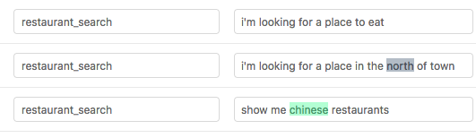

:desc: Read more about how to format training data with Rasa NLU for open
       source natural language processing.

.. _section_dataformat:

Training Data Format
====================

Data Format
~~~~~~~~~~~

You can provide training data as markdown or as json, as a single file or as a directory containing multiple files.
Note that markdown is usually easier to work with.

Markdown Format
---------------

Markdown is the easiest Rasa NLU format for humans to read and write.
Examples are listed using the unordered
list syntax, e.g. minus ``-``, asterisk ``*``, or plus ``+``.
Examples are grouped by intent, and entities are annotated as markdown links.

.. code-block:: md

    ## intent:check_balance
    - what is my balance <!-- no entity -->
    - how much do I have on my [savings](source_account) <!-- entity "source_account" has value "savings" -->
    - how much do I have on my [savings account](source_account:savings) <!-- synonyms, method 1-->
    - Could I pay in [yen](currency)?  <!-- entity matched by lookup table -->

    ## intent:greet
    - hey
    - hello

    ## synonym:savings   <!-- synonyms, method 2 -->
    - pink pig

    ## regex:zipcode
    - [0-9]{5}

    ## lookup:currencies   <!-- lookup table list -->
    - Yen
    - USD
    - Euro

    ## lookup:additional_currencies  <!-- no list to specify lookup table file -->
    path/to/currencies.txt

The training data for Rasa NLU is structured into different parts:
examples, synonyms, regex features, and lookup tables.

Synonyms will map extracted entities to the same name, for example mapping "my savings account" to simply "savings".
However, this only happens *after* the entities have been extracted, so you need to provide examples with the synonyms present so that Rasa can learn to pick them up.

Lookup tables may be specified either directly as lists or as txt files containing newline-separated words or phrases.  Upon loading the training data, these files are used to generate case-insensitive regex patterns that are added to the regex features.  For example, in this case a list of currency names is supplied so that it is easier to pick out this entity.

JSON Format
-----------

The JSON format consist of a top-level object called ``rasa_nlu_data``, with the keys
``common_examples``, ``entity_synonyms`` and ``regex_features``.
The most important one is ``common_examples``.

.. code-block:: json

    {
        "rasa_nlu_data": {
            "common_examples": [],
            "regex_features" : [],
            "lookup_tables"  : [],
            "entity_synonyms": []
        }
    }

The ``common_examples`` are used to train your model. You should put all of your training
examples in the ``common_examples`` array.
Regex features are a tool to help the classifier detect entities or intents and improve the performance.

Visualizing the Training Data
-----------------------------

If you're using the json format, it's always a good idea to `look` at your data before, during,
and after training a model. Luckily, there's a
`great tool <https://github.com/RasaHQ/rasa-nlu-trainer>`__
for creating training data in rasa's format.
- created by `@azazdeaz <https://github.com/azazdeaz>`_ -
and it's also extremely helpful for inspecting and modifying existing data.
`Rasa Platform <https://rasa.com/products/rasa-platform>`_ (Rasa's commercial product) also has
a full-featured UI for annotating data.

For the demo data the output should look like this:

If you use the json format it is **strongly** recommended that you view your training
data in the GUI before training.

Generating More Entity Examples
-------------------------------

It is sometimes helpful to generate a bunch of entity examples, for
example if you have a database of restaurant names. There are a couple
of great tools built by the community to help with that.

You can use `Chatito <https://rodrigopivi.github.io/Chatito/>`__ , a tool for generating training datasets in rasa's format using a simple DSL or `Tracy <https://yuukanoo.github.io/tracy>`__, a simple GUI to create training datasets for rasa.

Common Examples
---------------

Common examples have three components: ``text``, ``intent``, and ``entities``. The first two are strings while the last one is an array.

 - The *text* is the search query; An example of what would be submitted for parsing. [required]
 - The *intent* is the intent that should be associated with the text. [optional]
 - The *entities* are specific parts of the text which need to be identified. [optional]

Entities are specified with a ``start`` and  ``end`` value, which together make a python
style range to apply to the string, e.g. in the example below, with ``text="show me chinese
restaurants"``, then ``text[8:15] == 'chinese'``. Entities can span multiple words, and in
fact the ``value`` field does not have to correspond exactly to the substring in your example.
That way you can map synonyms, or misspellings, to the same ``value``.

.. code-block:: json

    {
      "text": "show me chinese restaurants",
      "intent": "restaurant_search",
      "entities": [
        {
          "start": 8,
          "end": 15,
          "value": "chinese",
          "entity": "cuisine"
        }
      ]
    }

Entity Synonyms
---------------
If you define entities as having the same value they will be treated as synonyms. Here is an example of that:

.. code-block:: json

    [
      {
        "text": "in the center of NYC",
        "intent": "search",
        "entities": [
          {
            "start": 17,
            "end": 20,
            "value": "New York City",
            "entity": "city"
          }
        ]
      },
      {
        "text": "in the centre of New York City",
        "intent": "search",
        "entities": [
          {
            "start": 17,
            "end": 30,
            "value": "New York City",
            "entity": "city"
          }
        ]
      }
    ]

as you can see, the entity ``city`` has the value ``New York City`` in both examples, even though the text in the first
example states ``NYC``. By defining the value attribute to be different from the value found in the text between start
and end index of the entity, you can define a synonym. Whenever the same text will be found, the value will use the
synonym instead of the actual text in the message.

To use the synonyms defined in your training data, you need to make sure the pipeline contains the ``EntitySynonymMapper``
component (see :ref:`section_pipeline`).

Alternatively, you can add an "entity_synonyms" array to define several synonyms to one entity value. Here is an example of that:

.. code-block:: json

  {
    "rasa_nlu_data": {
      "entity_synonyms": [
        {
          "value": "New York City",
          "synonyms": ["NYC", "nyc", "the big apple"]
        }
      ]
    }
  }

.. note::
    Please note that adding synonyms using the above format does not improve the model's classification of those entities.
    **Entities must be properly classified before they can be replaced with the synonym value.**

Regular Expression Features
---------------------------
Regular expressions can be used to support the intent classification and entity extraction. E.g. if your entity
has a certain structure as in a zipcode, you can use a regular expression to ease detection of that entity. For
the zipcode example it might look like this:

.. code-block:: json

    {
        "rasa_nlu_data": {
            "regex_features": [
                {
                    "name": "zipcode",
                    "pattern": "[0-9]{5}"
                },
                {
                    "name": "greet",
                    "pattern": "hey[^\\s]*"
                },
            ]
        }
    }

The name doesn't define the entity nor the intent, it is just a human readable description for you to remember what
this regex is used for and is the title of the corresponding pattern feature. As you can see in the above example, you can also use the regex features to improve the intent
classification performance.

Try to create your regular expressions in a way that they match as few words as possible. E.g. using ``hey[^\s]*``
instead of ``hey.*``, as the later one might match the whole message whereas the first one only matches a single word.

Regex features for entity extraction are currently only supported by the ``CRFEntityExtractor`` component! Hence, other entity
extractors, like ``MitieEntityExtractor`` or ``SpacyEntityExtractor`` won't use the generated features and their presence will not improve entity recognition
for these extractors. Currently, all intent classifiers make use of available regex features.

.. note::
    Regex features don't define entities nor intents! They simply provide patterns to help the classifier
    recognize entities and related intents. Hence, you still need to provide intent & entity examples as part of your
    training data!

Lookup Tables
-------------
Lookup tables in the form of external files or lists of elements may also be specified in the training data.  The externally supplied lookup tables must be in a newline-separated format.  For example, ``data/test/lookup_tables/plates.txt`` may contain

.. include:: ../../data/test/lookup_tables/plates.txt

And can be loaded as:

.. code-block:: json

    {
        "rasa_nlu_data": {
            "lookup_tables": [
                {
                    "name": "plates",
                    "elements": "data/test/lookup_tables/plates.txt"
                }
            ]
        }
    }

Alternatively, lookup elements may be directly included as a list

.. code-block:: json

    {
        "rasa_nlu_data": {
            "lookup_tables": [
                {
                    "name": "plates",
                    "elements": ["beans", "rice", "tacos", "cheese"]
                }
            ]
        }
    }

When lookup tables are supplied in training data, the contents are combined into a large, case-insensitive regex pattern that looks for exact matches in the training examples.  These regexes match over multiple tokens, so ``lettuce wrap`` would match ``get me a lettuce wrap ASAP`` as ``[0 0 0 1 1 0]``.  These regexes are processed identically to the regular regex patterns directly specified in the training data.

.. note::
    For lookup tables to be effective, there must be a few examples of matches in your training data.  Otherwise the model will not learn to use the lookup table match features.

.. warning::
    One must be careful with what kind of data is present in the lookup table.  For example if some of the elements are matched with commonly occuring words that are not the entity you wish to extract, this will limit the effectiveness of this method.  In fact, it might hurt the performance of entity recognition.  Therefore, try to use lookup tables only when you have a list of unambiguous phrases or tokens that you wish to match and make sure you filter out potentially problematic elements.

Organization
------------

The training data can either be stored in a single file or split into multiple files.
This can make it easier to keep things organised, or to share data between projects.
For example, if you have a restaurant bot which can also handle some basic smalltalk,
you could have a folder called ``nlu_data``:

.. code-block:: text

   nlu_data/
   ├── restaurants.md
   ├── smalltalk.md

To train a model with this data, pass the path to the directory to the train script:

.. code-block:: console

    $ rasa train nlu \
        --config config.yml \
        --data nlu_data/

.. note::
    Splitting the training data into multiple files currently only works for markdown and JSON data.
    For other file formats you have to use the single-file approach. You also cannot mix markdown
    and json

.. include:: feedback.inc
