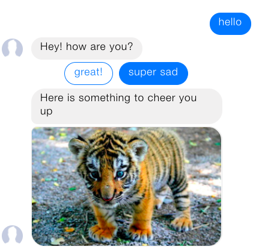

.. _tutorial_basics:

Building a Simple Bot
=====================

.. note::

    This tutorial will show you the different parts needed to build a bot. Be
    aware that this is a small example to get started quickly. It doesn't
    include a lot of training data, so there is some room for improvement of
    the final bot performance.

    `Example Code on GitHub <https://github.com/RasaHQ/rasa_core/tree/master/examples/moodbot>`_

Here we show how to create your first bot, adding all the pieces of a Rasa application.
This might be easier to follow if you also look at :ref:`plumbing`.

Goal
^^^^

We will create a very simple bot that checks our current mood and tries to
cheer us up if we are feeling sad. It will query our mood and based on our
reply will respond with a funny image or a message.

We created a `starter pack <https://github.com/RasaHQ/starter-pack>`_ to help
you get started with this tutorial (or any bot you're building), so the first
step is to clone this:

.. code-block:: bash

   git clone https://github.com/RasaHQ/starter-pack.git && cd starter-pack

The files that are important for this tutorial are described below:

.. code-block:: text

   starter-pack/
   ├── data/
   │   ├── stories.md            # dialogue training data
   │   └── nlu_data.md           # nlu training data
   ├── domain.yml                # dialogue configuration
   └── nlu_config.yml            # nlu configuration

Let's go through each of them! Just copy the example code below into each of
the relevant files as you go along.

Setup
^^^^^

For this tutorial to work, you need to have ``rasa_core`` installed,
``rasa_nlu``, as well as ``spaCy``:

.. code-block:: bash

    pip install rasa_nlu[spacy]
    pip install rasa_core

You'll also need the english language model:

.. code-block:: bash

    python -m spacy download en_core_web_md
    python -m spacy link en_core_web_md en

1. Define a Domain
^^^^^^^^^^^^^^^^^^

The first thing we need is a ``Domain``.
The domain defines the universe your bot lives in.

Here is an example domain for our moodbot, ``domain.yml``:

.. literalinclude:: ../examples/moodbot/domain.yml
    :language: yaml
    :name: domain.yml
    :linenos:

So what do the different parts mean?

+---------------+------------------------------------------------------------------------------------------------------+
| ``intents``   | things you expect users to say. See Rasa NLU for details.                                            |
+---------------+------------------------------------------------------------------------------------------------------+
| ``entities``  | pieces of info you want to extract from messages. See Rasa NLU for details.                          |
+---------------+------------------------------------------------------------------------------------------------------+
| ``actions``   | things your bot can do and say                                                                       |
+---------------+------------------------------------------------------------------------------------------------------+
| ``slots``     | information to keep track of during a conversation (e.g. a users age)                                |
+---------------+------------------------------------------------------------------------------------------------------+
| ``templates`` | template strings for the things your bot can say                                                     |
+---------------+------------------------------------------------------------------------------------------------------+

In our simple example we don't need ``slots`` and ``entities``, so these sections don't appear
in our definition.

**How does this fit together?**
Rasa takes the ``intent``, ``entities``, and the internal state of the dialogue,
and selects one of the ``actions`` that should be executed next.
If the action is just to say something to the user, Rasa will look for a matching
template in the domain (action name equals the utter template, as for
``utter_greet`` in the above example), fill in any variables,
and respond. For actions
which do more than just send a message, you can define them as
python classes and reference them in the domain by their module path. See
:ref:`custom_actions` for more information about custom actions.

.. note::

   There is one additional special action, ``ActionListen``, which means to stop taking
   further actions until the user says something else.
   It is not specified in the ``domain.yml``

2. Define an interpreter
^^^^^^^^^^^^^^^^^^^^^^^^

An interpreter is responsible for parsing messages. It performs the Natural
Language Understanding (NLU) and transforms the message into structured output.
In this example we are going to use Rasa NLU for this purpose.

In Rasa NLU, we need to define the user messages our bot should be able to
handle in the `Rasa NLU training data format <https://nlu.rasa.com/dataformat.html>`_.
In this tutorial we are going to use Markdown Format for NLU training data.
Let's create some intent examples in ``data/nlu_data.md``:

.. literalinclude:: ../examples/moodbot/data/nlu.md
    :linenos:
    :language: md

Furthermore, we need a configuration file, ``nlu_config.yml``, for the
NLU model:

.. literalinclude:: ../examples/moodbot/nlu_model_config.yml
    :linenos:

We can now train an NLU model using our examples (make sure to
`install Rasa NLU <http://nlu.rasa.com/installation.html#setting-up-rasa-nlu>`_
first, as well as
`spaCy <http://nlu.rasa.com/installation.html#best-for-most-spacy-sklearn>`_).

Let's run

.. code-block:: bash

   python -m rasa_nlu.train -c nlu_config.yml --data data/nlu_data.md -o models
   --fixed_model_name nlu --project current --verbose

to train our NLU model. A new directory ``models/current/nlu`` should have been
created containing the NLU model. Note that ``current`` stands for project name,
since this is specified in the train command.

.. note::

   To gather more insights about the above configuration and Rasa NLU features
   head over to the `Rasa NLU documentation <https://nlu.rasa.com>`_.

3. Define stories
^^^^^^^^^^^^^^^^^

So far, we've got an NLU model, a domain defining the actions our bot can
take, and inputs it should handle (intents & entities). We are still
missing the central piece, **stories to tell our bot what to do at which
point in the dialogue**.

A **story** is a training data sample for the dialogue system.
There are two different ways to create stories (and
you can mix them):

- create the stories by hand, writing them directly to a file
- create stories using interactive learning (see :ref:`tutorial_interactive_learning`).

For this example, we are going to create the stories by writing them directly
to ``stories.md``.
Stories begin with ``##`` and a string as an identifier. User intents start
with an asterisk ``*``, and bot actions are specified by lines beginning with a
dash ``-``. The end of a story is denoted by a newline. See :ref:`stories` for
more information about the data format.

Enough talking, let's head over to our stories:

.. literalinclude:: ../examples/moodbot/data/stories.md
    :linenos:
    :language: md

Be aware, although it is a bit faster to write
stories directly by hand instead of using interactive learning, special
care needs to be taken when using slots, as they need to be properly set in the
stories.

4. Put the pieces together
^^^^^^^^^^^^^^^^^^^^^^^^^^

There are two things we still need to do: train the dialogue model and run it.

To train the dialogue model, run:

.. code-block:: bash

   python -m rasa_core.train -d domain.yml -s data/stories.md -o models/current/dialogue --epochs 200

This will train the dialogue model for ``200`` epochs and store it
into ``models/current/dialogue``. Where ``1`` epoch corresponds to one pass of
the algorithm through all the training examples, which in this case are the stories.

Now we can use that trained dialogue model
and the previously created NLU model to run our bot.
Here we'll just talk to the bot on the command line:

.. code-block:: bash

   python -m rasa_core.run -d models/current/dialogue -u models/current/nlu

And there we have it! A minimal bot containing all the important pieces of
Rasa Core.

.. image:: _static/images/facebook-run.png

.. note::

    Button emulation does not work in console output, you need to type words like "great" or "sad"
    instead of numbers 1 or 2.

In order to restart the bot type ``/restart`` into the command line.

Bonus: Handle messages from Facebook
^^^^^^^^^^^^^^^^^^^^^^^^^^^^^^^^^^^^

If you want to handle input from Facebook instead of the command line, you can
specify that as part of the run command, after creating a credentials file
containing the information to connect to facebook. Let's put that
into ``fb_credentials.yml``:

.. literalinclude:: ../examples/moodbot/fb_credentials.yml
   :linenos:

If you are new to Facebook Messenger bots, head over to
:ref:`facebook_connector` for an explanation of the different values.

After setting that up, we can now run the bot using

.. code-block:: bash

   python -m rasa_core.run -d models/dialogue -u models/nlu/current \
      --port 5002 --connector facebook --credentials fb_credentials.yml

and it will now handle messages users send to the Facebook page.

.. raw:: html
   :file: poll.html
