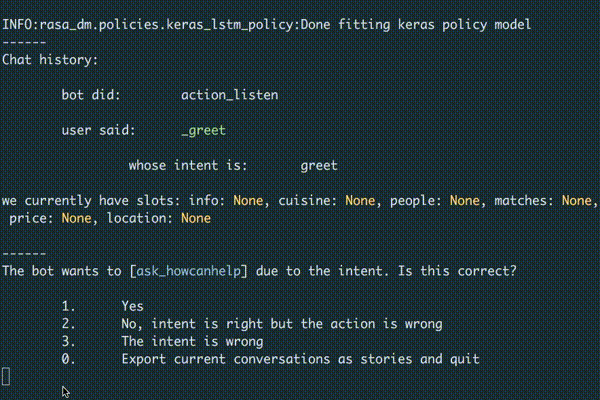

.. _tutorial_fake_user:

Interactive Learning with a Fake User
=====================================

In this example we will:

- Introduce the platform for interactive interactive policy learning

- Do a test example against a fake user

Model and Data
--------------

We do a similar task to the ``examples/babi`` example where we want a
chatbot to help recommend restaurants. Because of this we use an almost
identical ``Policy`` and ``Domain`` which are found in ``restaurant_policy.py``.
However we trim some actions to simplify the action space as this is only an example.

If you are interested in the practicalities of the model, then the bAbI
example :ref:`tutorial_babi` is worth reading.

Why Interactive Learning?
--------------------

There are some complications to chatbot training which makes them more
tricky than most machine learning problems.

The first is that there
are several ways of getting to the same goal, and they may all be equivalently good.
Therefore it is wrong to say with certainty that given X, you should do Y,
and if you do not do exactly Y then you are wrong. This is essentially
what you do in a fully supervised learning case. We want the bot
to be able to learn it can get to a successful state through a number of
different means.

Secondly, the utterances from users will be strongly affected by the
actions of the bot. That means that a network trained on pre-collected
data will suffer from `exposure bias <https://arxiv.org/abs/1511.06732>`_,
this is when a system is trained to make predictions but is never given the ability to train on its own predictions, instead being given the 
ground truth every time. This has been shown to have issues when trying 
to predict sequences multiple steps into the future.

Also, from a practical perspective Rasa Core developers should be able to train
via the `Wizard of Oz <https://en.wikipedia.org/wiki/Wizard_of_Oz_experiment>`_
method. I.e. if you want a bot to do a certain task, you can simply
pretend to be a bot for a little while and at the end it will learn how
to respond. This is a good way of learning how to make natural and flowing
conversations.

Example: Fake User
------------------

For our example we have a fake user who decides they want to book a table
at a restaurant. **They decide at the start what cuisine, location, price
and number of people they want at the dinner, it is your job to find it out.**

Once you believe that your slots (cuisine, location, etc.) are the correct ones,
you may suggest a restaurant. If your slots match theirs then they will affirm
and it will have been a successful dialogue. **Once you have completed
a dialogue, choose the reset action to start again from the beginning**.

After several rounds of this the network should begin to learn how to respond
and you should not need to help much!

If you want to try to improve on a pre-trained model, go for

.. code-block:: bash

   python examples/fake_user/train.py pretrained

Or if you want to get started from almost absolute scratch then run

.. code-block:: bash

   python examples/fake_user/train.py scratch

The experience should look a bit like this gif:

Tips
::::

- Make sure that once the user provides you with an entity you either have slot that is named exactly like the entity or you manually store the entites value in a slot

- Ask! If you haven't got one of the slots that you need, choose the corresponding action to ask for the slot value.

- The fake user might change their mind, so keep on your toes.

- If the conversation is going really badly, just select the reset action and try again.
