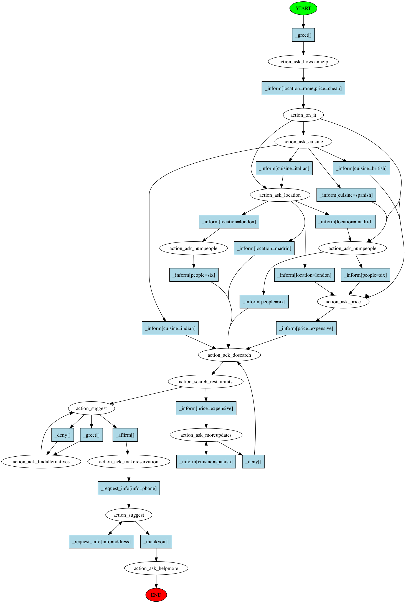

.. _tutorial_supervised:

Supervised Learning Tutorial
============================

.. testsetup::

   import os, sys
   p = os.path.abspath(os.path.join('examples', 'restaurantbot'))
   os.chdir(p)
   sys.path.append(p)

.. note::

   This tutorial will cover how to use Rasa Core directly from python. We will
   dive a bit deeper into the different concepts and overall structure of the
   library. You should already be familiar with the terms domain, stories, and
   have some knowledge of NLU (if not,
   head :ref:`tutorial_basics` first).
   Here, we'll be using the `Example Code on GitHub <https://github.com/RasaHQ/rasa_core/tree/master/examples/restaurantbot>`_.

Goal
^^^^

In this example we will create a restaurant search bot by training a
neural network on example conversations. A user can contact the bot with
something close to ``"I want a mexican restaurant!"`` and the bot will ask
more details until it is ready to suggest a restaurant.

First Steps
^^^^^^^^^^^

Let's start by heading over to the directory for our restaurant bot. All
example code snippets assume you are running the code from within that
project directory:

.. code-block:: bash

   cd examples/restaurantbot

1. The Domain
^^^^^^^^^^^^^

Let's inspect the domain
definition in ``restaurant_domain.yml``:

In addition to the previous example, there are two sections: ``slots`` and ``entities``.

``slots`` are used to store user preferences, like the cuisine and price range of a restaurant. 
``entities`` are closely related to slots. Slots are updated over time, and entities are the raw
information that's picked up from user messages. But slots can also be used to store information about
the outside world, like the results of API calls, or a user profile read from a database. 
Here we have a slot called ``matches`` which stores the matching restaurants returned by an API.

.. literalinclude:: ../examples/restaurantbot/restaurant_domain.yml
    :linenos:

Custom Actions
--------------

In this example we also have custom actions: ``bot.ActionSearchRestaurants`` and ``bot.ActionSuggest``,
where ``bot.`` stands for the name of the module where this action is defined.
An action can do much more than just send a message.
Here's a small example of a custom action which calls an API.
Notice that the ``run`` method can use the values of the slots, which are stored in the tracker.

.. literalinclude:: ../examples/restaurantbot/bot.py
    :linenos:
    :pyobject: ActionSearchRestaurants

But a domain alone doesn't make a bot; we need some training data to tell the
bot which actions it should execute at what point in the conversation.
We need some conversation training data - the *stories*!

2. The Training Data
^^^^^^^^^^^^^^^^^^^^

Take a look at ``data/babi_stories.md``, where the training conversations
for the restaurant bot are defined. One example story looks as follows:

.. code-block:: md
    :linenos:

    ## story_00914561
    * greet
     - utter_ask_howcanhelp
    * inform{"cuisine": "italian"}
     - utter_on_it
     - utter_ask_location
    * inform{"location": "paris"}
     - utter_ask_numpeople
    * inform{"people": "six"}
     - utter_ask_price
     ...

See :ref:`training_data_details` below to get more information about this
training data.

3. Training your bot
^^^^^^^^^^^^^^^^^^^^

We can go directly from data to bot with only a few steps:

1. Train a Rasa NLU model to extract intents and entities. Read more about that in the `NLU docs <http://rasa-nlu.readthedocs.io/>`_.
2. Train a dialogue policy which will learn to choose the correct actions.
3. Set up an agent which has both model 1 (the NLU) and model 2 (the dialogue) working together to go directly from **user input** to **action**.

We will go through these steps one by one.

NLU model
---------

To train our Rasa NLU model, we need a configuration file, which you can
find in ``nlu_model_config.yml``:

.. literalinclude:: ../examples/restaurantbot/nlu_model_config.yml
   :linenos:

And training data ``franken_data.json`` (see
`NLU Dataformat <https://nlu.rasa.com/dataformat.html>`_ for details
about the training data format).

We can train the NLU model using

.. code-block:: bash

   python -m rasa_nlu.train -c nlu_model_config.yml --fixed_model_name current \
          --data ./data/franken_data.json --path ./models/nlu

or using python code

.. literalinclude:: ../examples/restaurantbot/bot.py
   :linenos:
   :pyobject: train_nlu

and calling

.. code-block:: bash

    python bot.py train-nlu

*Training NLU takes approximately 18 seconds on a 2014 MacBook Pro.*

A Custom Dialogue Policy
------------------------

Now our bot needs to learn what to do in response to user messages. We do
this by training one or multiple Rasa Core policies.

For this bot, we came up with our own policy.
This policy extends the Keras policy modifying the ML architecture of the
underlying neural network.
Check out the
``RestaurantPolicy`` class in ``policy.py`` for the glory details:

.. literalinclude:: ../examples/restaurantbot/policy.py
   :linenos:
   :pyobject: RestaurantPolicy

The parameters ``max_history_len`` and ``n_hidden``
may be altered dependent on the task complexity and the amount of data one
has. ``max_history_len`` is important as it is the amount of previous story steps the
network has access to make a classification.

Because we've created a custom policy, we can't train the bot by running ``rasa_core.train``
like in the :ref:`tutorial_basics`. The ``bot.py`` script shows how you can
train a bot that uses a custom policy and actions.

.. note::

   Remember, you do not need to create your own policy. The default policy
   setup using a *memoization* policy and a *Keras* policy works quite well.
   Nevertheless, you can always fine tune them for your use case. Read
   :ref:`plumbing` for more info.

Now let's train it:

.. literalinclude:: ../examples/restaurantbot/bot.py
   :linenos:
   :pyobject: train_dialogue

This code creates the policies to be trained and uses the story training
data to train and persist (store) a model. The goal of the trained policy
is to predict the next action, given the current state of the bot.

To train the dialogue policy from the command line, run

.. code-block:: bash

   python bot.py train-dialogue

*Training the dialogue model takes roughly 12 minutes on a 2014 MacBook Pro*

4. Using the bot
^^^^^^^^^^^^^^^^

Now we're going to glue some pieces together to create an actual bot.
We instantiate an ``Agent``, which owns our trained ``Policy``, a ``Domain`` from ``models/dialogue``,
and our NLU ``Interpreter`` from ``models/nlu/default/current``.

For this demonstration, we will send messages directly to the bot out of a
python console. You can look at how to build a command line bot and a
facebook bot by checking out the :ref:`connectors`.

.. doctest::

   from rasa_core.interpreter import RasaNLUInterpreter
   from rasa_core.agent import Agent

   agent = Agent.load("models/dialogue", interpreter=RasaNLUInterpreter("models/nlu/default/current"))

We can then try sending it a message:

.. doctest::

   >>> agent.handle_message("/greet")
   [u'hey there!']

And there we have it! A minimal bot containing all the important pieces of
Rasa Core.

.. note::

   Here, we've skipped the NLU interpretation of our message by directly
   providing the underlying intent ``greet`` (see
   :ref:`fixed_intent_format`).

If you want to handle input from the command line (or a different input
channel) you need handle that channel instead of handling messages directly,
e.g.:

.. code-block:: python

   from rasa_core.channels.console import ConsoleInputChannel
   agent.handle_channel(ConsoleInputChannel())

In this case messages will be retrieved from the command line because we specified
the ``ConsoleInputChannel``. Responses are printed to the command line as well.

You can find a complete example of how to load an agent and chat with it on the
command line in the restaurant bot's ``bot.py`` ``run`` method.
To run the bot from the command line, call

.. code-block:: bash

    python bot.py run

If the bot appears to be stuck or answers incorrectly, do not worry.
The provided dataset is not diverse enough to handle all possible inputs,
as can be seen from visualization of the training data below.
One can use :ref:`tutorial_interactive_learning` to augment the training data
with custom stories.

The Details
^^^^^^^^^^^

.. _training_data_details:

Training Data
-------------

The training conversations come from the `bAbI dialog task <https://research
.fb.com/downloads/babi/>`_. However, the messages in these
dialogues are machine generated, so we will augment this dataset with real
user messages from the `DSTC dataset <http://camdial.org/~mh521/dstc/>`_.
Lucky for us, this dataset is also in the restaurant domain.

.. note::

   The bAbI dataset is machine-generated, and there are a LOT of dialogues in
   there. There are 1000 stories in the training set, but you don't need that
   many to build a useful bot. How much data you need depends on the number of
   actions you define, and the number of edge cases you want to support. But a
   few dozen stories is a good place to start.

We have converted the bAbI dialogue training set into the Rasa stories
format, and you can download the stories training data from `GitHub
<https://raw.githubusercontent.com/RasaHQ/rasa_core/master/examples/
restaurantbot/data/babi_stories.md>`_. That file is stored in
``data/babi_stories.md``.

See :ref:`stories` to get more information about the Rasa Core data format.
We can also visualize that training data to generate a graph which is
similar to a flow chart:

The graph shows all of the actions executed in the training data, and the
user messages (if any) that occurred between them. As you can see, flow
charts get complicated quite quickly. Nevertheless, they can be a helpful
tool in debugging a bot. For example, it can be clearly seen that there is
not enough data for handling reservation. To learn how to build this chart go to
:ref:`story-visualization`.

.. raw:: html 
   :file: poll.html
